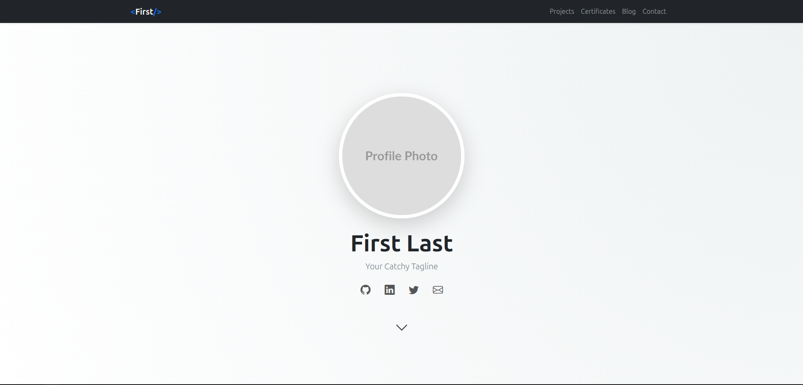

<div align="center">

# Amazing Portfolio
**The professional Jekyll portfolio.**

[](https://github.com/lakshyaelite/amazing-portfolio/generate)
[](https://jekyllrb.com/)
[](https://getbootstrap.com/)
[](https://opensource.org/licenses/MIT)

<br />



### ~Live Demo~ • [Report Bug](https://github.com/lakshyaelite/amazing-portfolio/issues) • [Request Feature](https://github.com/lakshyaelite/amazing-portfolio/issues)

</div>

## ✨ Key Features

* **🌓 Automatic Dark Mode:** Built-in theme switching using Bootstrap 5.3.
* **💻 macOS Code Blocks:** Custom Prism.js setup with window controls and high-specificity "Copy" buttons.
* **📜 Data-Driven Sections:** Manage Certificates, Projects, and Socials via simple YAML files.
* **🚀 GitHub Actions Ready:** Zero-config deployment to GitHub Pages.
* **📱 Ultra Responsive:** Perfectly optimized for desktops, tablets, and mobile.

---

## 🛠️ Getting Started

### 1. Use as Template
Click the **"Use this template"** button at the top of this repository to create a new repo in your account.

### 2. Local Setup
If you want to customize and preview locally, ensure you have Ruby and Jekyll installed:

```bash
# Check prerequisites
ruby -v
bundle -v

# Clone and Install
git clone https://github.com/your-username/your-repo-name.git
cd your-repo-name
bundle install

# Run local server
bundle exec jekyll serve
````

Your site will live at `http://127.0.0.1:4000`.

-----

## 🎨 Personalization

Customize the portfolio by editing these specific files:

| File | Action |
| :--- | :--- |
| `_config.yml` | Set your `title`, `description`, `email`, and `baseurl`. |
| `_data/certificates.yml` | List your certifications and issuer details. |
| `_data/projects.yml` | Add your portfolio items and image paths. |
| `_data/socials.yml` | Link your GitHub, LinkedIn, and Twitter profiles. |
| `style.css` | Update `--primary-color` to match your brand. |

-----

## 🚀 Deployment

This template is fully optimized for **GitHub Actions**.

1.  Push your changes to the `main` branch.
2.  Navigate to **Settings \> Pages** in your GitHub repo.
3.  Under **Build and deployment \> Source**, select **GitHub Actions**.
4.  GitHub will automatically detect the Jekyll workflow and deploy your site\!

-----

<div align="center"\>
<sub\>Built with ❤️ by <a href="https://lakshyasinghchauhan.com"\>Lakshya</a\></sub\>
</div\>
